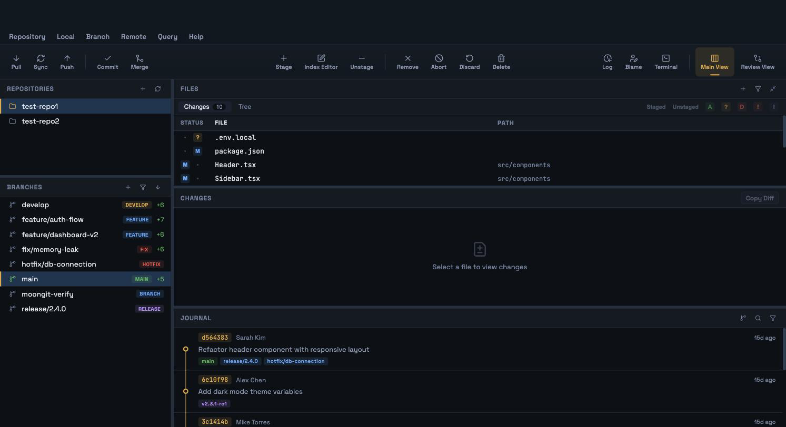
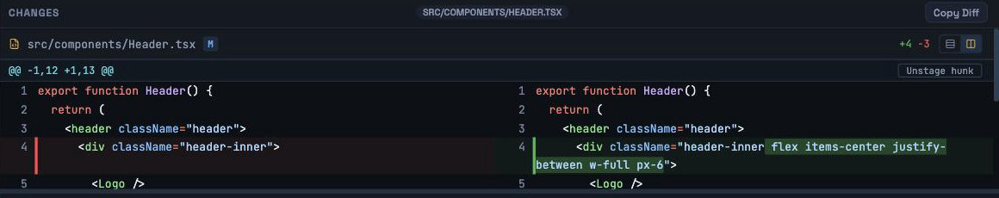
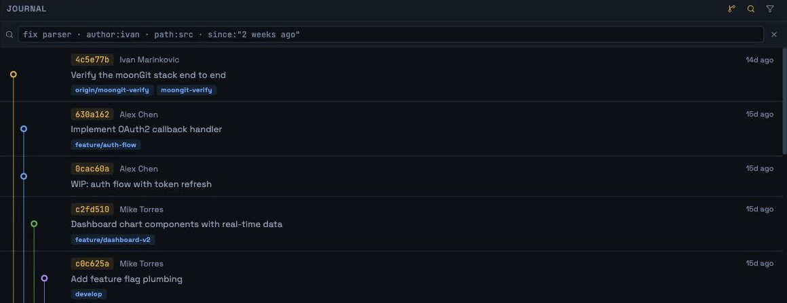
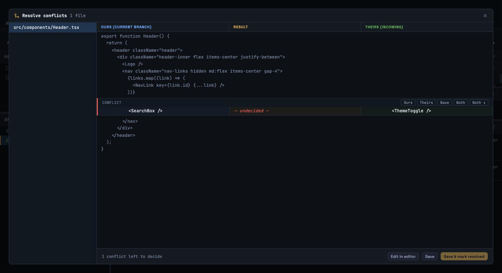

<div align="center">


# moonGit

**A native macOS Git client.**

Wails v2 · React 19 · TypeScript · SQLite · no Electron

</div>

---

## Screenshots

<!--
  Four PNGs under docs/screenshots/. See docs/README.md for specs and for how
  to capture them.
-->

| | |
|:---:|:---:|
|  |  |
| **Workspace** — repositories, branches, files, changes and history, all resizable | **Diff viewer** — side-by-side or inline, syntax highlighted, staged by hunk or by line |
|  |  |
| **History** — a real lane graph, with qualifier search over authors, paths and dates | **Merge** — a three-way resolver with per-region choices |

---

## What it does

### Working tree

- **Stage and unstage by file, by hunk, or by individual line.** The index editor builds a patch and applies it with `git apply --cached`, so the staged result is git's own, not an approximation.
- **Status columns** — `STATUS | FILE | PATH`, with the path truncating from the left so the leaf directory stays readable, and renames split correctly across the two columns.
- **Seven status filter chips** — staged, unstaged, added, untracked, deleted, conflicted, ignored — combinable with a text filter.
- **Discard**, with a native confirmation.
- **Commit** with a composer, amend, and `⌘↵` to commit.

### Diff

- Side-by-side and inline views.
- Syntax highlighting via **Shiki**, loaded per language on demand, following the active theme.
- **Word-level diff** inside changed lines.
- **Image diff** for binary image files.
- A **large-file guard**, so opening a 40MB generated file does not lock the window.

### History

- **Commit graph** with lane assignment, branch colours and merge visualisation.
- **Search** with the qualifier syntax every code host has trained people on — `author:`, `path:`, `since:`, `until:`, with quoting. An unrecognised `key:value` is searched as literal text rather than rejected.
- **File log** — history filtered to one path, from the file's context menu or a commit.
- Commit context menu: show changes, cherry-pick (with or without committing), create a tag here, history from here, copy SHA or subject.

### Branching and integration

- **Merge** — a wizard with conflict detection, plus a three-way conflict resolver with per-region choices and an escape hatch to your own editor.
- **Rebase** — interactive, with a todo editor supporting pick, edit, squash, fixup, drop and reorder, and continue/skip/abort while the rebase is in progress. `reword` is deliberately absent — it would open `GIT_EDITOR` on the message, which here is a no-op, so `edit` offers the same power honestly.
- **Cherry-pick** — onto the current branch, with or without committing.
- **Stash** — push, apply, pop and drop.
- **Tags** — create at HEAD or at any commit.
- **Remotes** — fetch, pull, push, and remote management. Credential and SSH prompts become UI rather than a hung process.

### Around the edges

- **File explorer** with a lazily-loaded tree and **quick open** (`⌘P`).
- **Terminal** (`⌃\``) — a real pty in a bottom drawer, scoped to the repository, so you can run `git rebase --continue` while reading the file list rather than instead of it.
- **Repository settings** — ignore rules with an explainer for which rule matches, and git config for the local scope against the effective one.
- **Settings** (`⌘,`) — light, dark or system theme, and the git binary path.
- **Native macOS menu bar**, driven from the same structure as the in-window menubar.
- **Live refresh from a file watcher.** No polling, no refresh button — a Go-side watcher debounces filesystem noise into one event carrying *which* areas changed, and that maps onto the exact queries those areas affect. Saving a file does not re-read the ref list.
- **Adaptive tuning for large repositories.** A repository whose status is slow gets `core.fsmonitor`, an untracked cache and a commit-graph, and degrades to collapsed untracked directories — measured at 4442ms → 132ms on 500k files. It says so on screen and the degrade is reversible.

---

## Not yet wired up

Kept honest on purpose. Each of these has a working service layer and no path to it from the interface:

| | Status |
|---|---|
| **Branch checkout, create, rename, delete** | `BranchService` and the mutations exist and are tested; the branch list only selects, and the menu items are stubs. **You cannot currently switch branches from the UI.** |
| **Blame** | `BlameService` and `useBlame` exist; nothing renders them. |
| **Clone** | Menu stub. Repositories are added by opening an existing directory. |
| **Pull requests** | Menu stub. No forge integration. |
| **Hooks, LFS, submodules** | Deliberately excluded from repository settings, each for a reason recorded in `PLAN.md` §9. |
| **Content search** (`git grep`) | Search covers commits, not file contents. |

Phases 0–6 are complete and Phase 7 (performance) is in progress. `PLAN.md` is the real record — it documents what was built, what was measured, and the places where the result argued with the plan.

---

## Building

Requires macOS, Go 1.25+, Node 20+, and the [Wails v2 CLI](https://wails.io/docs/gettingstarted/installation).

```sh
go install github.com/wailsapp/wails/v2/cmd/wails@v2.13.0

make dev      # run with hot reload
make build    # produce a packaged .app in build/bin
```

## Development

```sh
make check         # everything CI would run: lint, typecheck, tests
make test          # Go + frontend tests
make lint          # go vet + eslint
make typecheck     # tsc --noEmit
make bindings      # regenerate the TypeScript bindings from the Go services
```

### Test repositories

```sh
make seed          # put ../testGitHere/test-repo{1,2} into a rich state
make seed-reset    # restore them to pristine origin/main
```

Automated tests never mutate those — they are real repositories with real remotes. Tests build their own throwaway repositories in a temp directory. See `PLAN.md` §13a.

### Benchmarks

```sh
make seed-large    # generate 500k-file and 1M-commit repositories (~4 min, ~2.1G)
make bench         # time the app's own git commands against them
make seed-large-clean
```

The benchmark imports its argument vectors from the application source rather than restating them, so it cannot drift from what the app actually runs.

---

## Architecture

The one rule everything else follows: **Go knows nothing about git.**

`internal/gitexec` spawns a process and returns `{stdout, stderr, exitCode}`. It has no concept of a commit, a branch or a diff. Every parser, every domain service and every decision lives in TypeScript, which means the interesting logic is testable without a running application — and it is: 648 frontend tests, most of them over parsers fed real captured git output.

```
internal/          Go — 9 services, one native capability each
  gitexec            spawn, stream, cancel, timeout
  store              SQLite (modernc.org/sqlite, no CGO) — app state only, never git state
  watcher            filesystem events, debounced and classified
  fsapi ptyapi shellapi creds dialogs appmenu

frontend/src/
  services/git/    parsers + domain services — the whole git layer
  queries/         TanStack Query bindings and the invalidation rules
  features/        one directory per feature, CSS Modules alongside
  stores/          Zustand, repo-scoped
```

**SQLite stores app state only** — window layout, preferences, the repository list. Never refs, HEAD, status or ahead/behind counts. Git is the source of truth for git data; a cache of it would be a cache that goes stale in ways the user notices.

Full rationale, including four deliberate deviations from the original PRD, is in `PLAN.md`.

---

## License

Not yet chosen.
